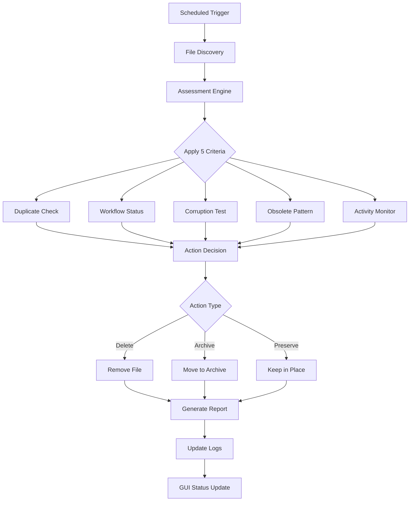

# Utils Folder Cleanup System Documentation

## Overview

The `/utils/` folder cleanup system provides comprehensive, assessment-based file management for the GlowingGoldenGlobe AI Workflow project. This system automatically evaluates files using intelligent criteria and performs scheduled cleanup operations to maintain an organized and efficient workspace.

## System Architecture

### Core Components

1. **Assessment Engine** (`assessment_based_cleanup.py`)
   - Comprehensive file analysis using 5 assessment criteria
   - Content-based duplicate detection
   - Workflow completion status evaluation
   - File corruption and validity checking
   - Session activity monitoring
   - Obsolete file pattern recognition

2. **Scheduled Task Integration** (`ai_managers/scheduled_tasks_manager.py`)
   - Monthly automated cleanup execution (720-hour interval)
   - Integrated with existing task scheduling infrastructure
   - Automatic report generation and logging

3. **GUI Management Interface** (`gui/cleanup_tasks_tab.py`)
   - "Tasks & Schedule" tab in the main GUI
   - Manual assessment and cleanup capabilities
   - Real-time configuration management
   - Visual status monitoring and reporting

## Assessment Criteria

The cleanup system evaluates files using five comprehensive criteria:

### 1. Duplicate Detection
- **Hash-based exact duplicates**: Files with identical content
- **Content similarity analysis**: Text files with 95%+ similarity
- **Intelligent comparison**: Considers file type and content structure

### 2. Workflow Completion Status
- **Filename pattern analysis**: Identifies "completed", "done", "finished" indicators
- **File age assessment**: Files older than 30 days likely completed
- **Content keyword scanning**: Searches for completion markers in file content

### 3. File Corruption/Validity
- **Syntax validation**: Python files checked with `py_compile`
- **Readability testing**: Text files validated for encoding integrity
- **Existence verification**: Ensures files are accessible and non-zero size

### 4. Obsolete File Identification
- **Pattern matching**: Detects temp_, tmp_, test_, _backup, _old patterns
- **Extension analysis**: Identifies .bak, .tmp, .cache files
- **Age-based obsolescence**: Temporary files older than 7 days
- **Zero-byte detection**: Empty files flagged for removal

### 5. Session Activity Tracking
- **Access time monitoring**: Files not accessed within 30 days
- **Modification tracking**: Recent changes indicate active use
- **Activity ratio calculation**: Overall folder usage patterns

## Cleanup Actions

Based on assessment results, the system takes three types of actions:

### 🗑️ Delete
- Corrupted or invalid files
- Zero-byte files
- Obsolete files with no recent access
- Files meeting deletion criteria

### 📦 Archive
- Completed workflow files with no recent activity
- Files inactive for 60+ days
- Obsolete files with recent access (safety measure)

### 🛡️ Preserve
- Active files with recent modifications
- Files with ongoing workflow indicators
- System-critical utilities
- Files not meeting cleanup criteria

## Scheduling Configuration

### Automatic Scheduling
- **Default interval**: 30 days (720 hours)
- **Execution time**: Integrated with system task scheduler
- **Report generation**: Automatic JSON reports with timestamps
- **Log integration**: Full activity logging to system logs

### Manual Configuration
- **GUI controls**: Adjustable intervals (7-90 days)
- **Threshold settings**: Customizable age limits for archive/delete
- **Dry-run mode**: Preview actions without execution
- **Immediate execution**: On-demand assessment and cleanup

## File Management Workflow



## Configuration Files

### 1. `cleanup_tasks_config.json`
```json
{
  "auto_cleanup_enabled": true,
  "schedule_interval_days": 30,
  "dry_run_mode": false,
  "delete_threshold_days": 60,
  "archive_threshold_days": 30,
  "last_updated": "2025-01-01T00:00:00"
}
```

### 2. Assessment Criteria Thresholds
```python
criteria = {
    "duplicate_similarity_threshold": 0.95,
    "session_inactivity_days": 30,
    "temp_file_age_days": 7,
    "obsolete_patterns": [
        "temp_", "tmp_", "test_", "_backup", "_old", "_temp",
        ".bak", ".tmp", ".cache", "_cache"
    ]
}
```

## Usage Instructions

### GUI Interface Usage

1. **Access the Interface**
   - Launch the GlowingGoldenGlobe GUI
   - Navigate to the "Tasks & Schedule" tab

2. **Configure Settings**
   - Enable/disable automatic cleanup
   - Set schedule interval (7-90 days)
   - Configure age thresholds for archive/delete
   - Toggle dry-run mode for testing

3. **Manual Operations**
   - Click "Run Assessment Now" for immediate analysis
   - Use "View Last Report" to examine results
   - Execute "Manual Cleanup" with confirmation

### Command Line Usage

```bash
# Run assessment and generate report
python utils/assessment_based_cleanup.py --report-only

# Preview cleanup actions (dry run)
python utils/assessment_based_cleanup.py --dry-run

# Execute cleanup
python utils/assessment_based_cleanup.py --execute

# Specify custom utils directory
python utils/assessment_based_cleanup.py --utils-dir /path/to/utils --dry-run
```

## Report Structure

Assessment reports are saved as JSON files with the following structure:

```json
{
  "timestamp": "2025-01-01T12:00:00",
  "total_files": 25,
  "assessment_criteria": {
    "duplicates": {"total_duplicate_sets": 2},
    "workflow_completion": {"completion_ratio": 0.6},
    "corruption": {"corruption_rate": 0.0},
    "obsolete_files": {"obsolete_ratio": 0.2},
    "session_activity": {"activity_ratio": 0.8}
  },
  "cleanup_recommendations": [
    "Found 2 duplicate file sets - consider removing redundant copies"
  ],
  "files_to_preserve": [...],
  "files_to_archive": [...],
  "files_to_delete": [...]
}
```

## Integration Points

### Scheduled Tasks Manager
- Task ID: `utils_assessment_cleanup`
- Priority: Medium
- Auto-execution: Enabled
- Logging: Full integration with system logs

### GUI System Integration
- Tab integration with main notebook widget
- Real-time status updates
- Configuration persistence
- Thread-safe operations

### AI Workflow Integration
- Respects restricted automation settings
- Integrates with session detection
- Follows project file organization conventions
- Supports parallel execution patterns

## Safety Features

### Backup and Recovery
- **Archive directory**: `utils/archived_files/`
- **Report history**: Timestamped JSON reports
- **Dry-run testing**: Preview all actions before execution
- **Error logging**: Comprehensive error tracking and reporting

### User Controls
- **Manual override**: GUI controls for immediate intervention
- **Configuration validation**: Input validation and range checking
- **Confirmation dialogs**: User confirmation for destructive actions
- **Status monitoring**: Real-time feedback on all operations

### Fail-Safe Mechanisms
- **Error handling**: Graceful failure with detailed logging
- **Path validation**: Ensures operations stay within utils directory
- **Permission checking**: Validates file access before operations
- **Rollback capability**: Archive functionality allows file recovery

## Maintenance and Monitoring

### Log Files
- **System logs**: Integration with `parallel_execution_scheduler.log`
- **Assessment reports**: JSON files in `/utils/` directory
- **GUI logs**: Status updates and error reporting
- **Task execution**: Detailed action logs with timestamps

### Performance Monitoring
- **Execution time**: Tracked for each assessment run
- **File count metrics**: Monitor folder growth and cleanup effectiveness
- **Error rate tracking**: Identify and resolve recurring issues
- **Resource usage**: Monitor system impact during operations

### Regular Maintenance
- **Report cleanup**: Archive old assessment reports (handled by log_cleanup task)
- **Configuration backup**: Periodic config file backups
- **System health checks**: Integration with hardware monitoring
- **Performance optimization**: Regular review of cleanup criteria effectiveness

## Troubleshooting

### Common Issues

1. **Assessment fails to run**
   - Check file permissions in `/utils/` directory
   - Verify Python module imports are working
   - Review system logs for error details

2. **GUI tab not responding**
   - Check thread safety in GUI operations
   - Verify tkinter integration is functional
   - Restart GUI if necessary

3. **Cleanup actions not executing**
   - Verify dry-run mode is disabled for actual cleanup
   - Check file permissions for delete/move operations
   - Review restricted automation settings

4. **Scheduled tasks not running**
   - Check `scheduled_tasks_manager.py` configuration
   - Verify task is enabled in `parallel_execution_tasks.json`
   - Review system task scheduler logs

### Debug Mode
Enable detailed logging by modifying the logging level in `assessment_based_cleanup.py`:
```python
logging.basicConfig(level=logging.DEBUG)
```

## Future Enhancements

### Planned Features
- **Machine learning assessment**: AI-powered file importance scoring
- **Cloud storage integration**: Automated backup to cloud services
- **Pattern learning**: Adaptive cleanup based on user behavior
- **Integration with version control**: Git-aware cleanup decisions

### Configuration Extensions
- **Custom pattern rules**: User-defined obsolete file patterns
- **Role-based cleanup**: Different rules for different user types
- **Project-specific settings**: Cleanup rules per project type
- **Time-based scheduling**: More granular scheduling options

---

*Last updated: 2025-01-01*  
*System version: 1.0*  
*Maintained by: GlowingGoldenGlobe AI Workflow Team*